## Stockinsite ( Stock-Broker multi user website )


A comprehensive web application for managing a Demat account and performing stock analysis with Gen AI.

* Integrated a **GenAI Financial Assistant** with conversational memory, enabling users to analyze stocks, understand investment concepts, and ask follow-up questions using relevant context from previous conversations.
* Developed a robust **Python Flask backend** with AWS RDS to efficiently manage and process large financial datasets.
* Implemented **interactive Google Charts** for analyzing company revenue, profit trends, balance sheets, and other financial metrics.
* Built comprehensive **portfolio management features including profit/loss tracking**, company-wise contribution analysis, and fund diversification insights.
* Developed stock comparison tools to evaluate companies across financial metrics such as Profit/Loss, ROE, ROCE, and other fundamental indicators.
* Integrated automated technical level computation using **fundamental and technical market analysis**.
* Designed a scalable cloud-based architecture with support for local deployment and integrated external financial data sources for market analysis.
* Currently extending the platform with machine learning-based stock price prediction and advanced GenAI capabilities for financial analysis and investment education.

Highlight: A full-stack financial analytics platform combining Python, Flask, AWS, financial data analytics, data visualization, machine learning, and Generative AI.


## Steps to install project into local

```bash

git clone https://github.com/Aravind8967/stockinsite.git
cd stockinsite

pip install --no-cache-dir -r requirements.txt

# To start the project 

python wsig.py

```

# System design Images


# Project Images


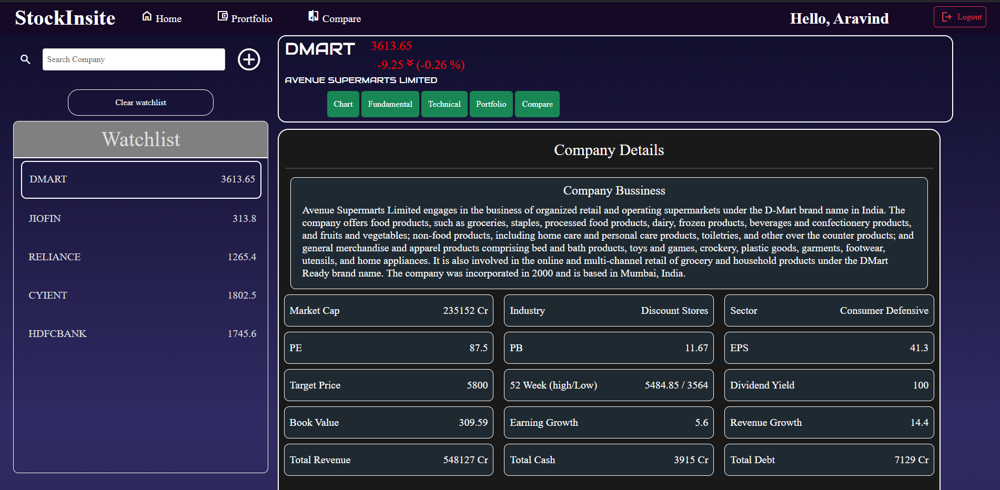

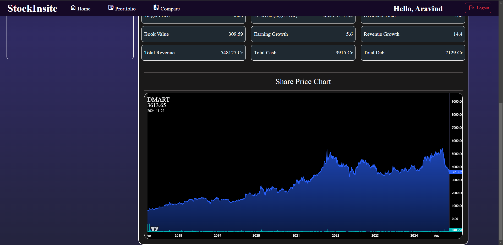

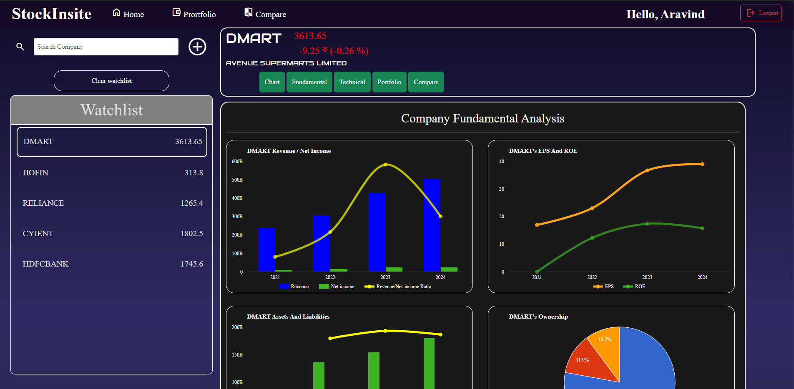

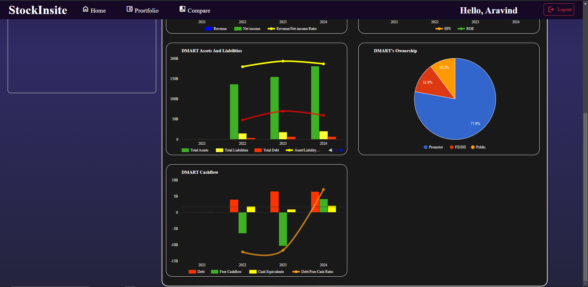

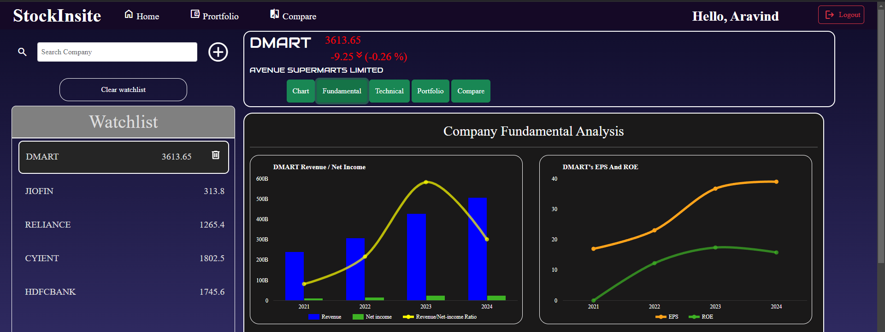

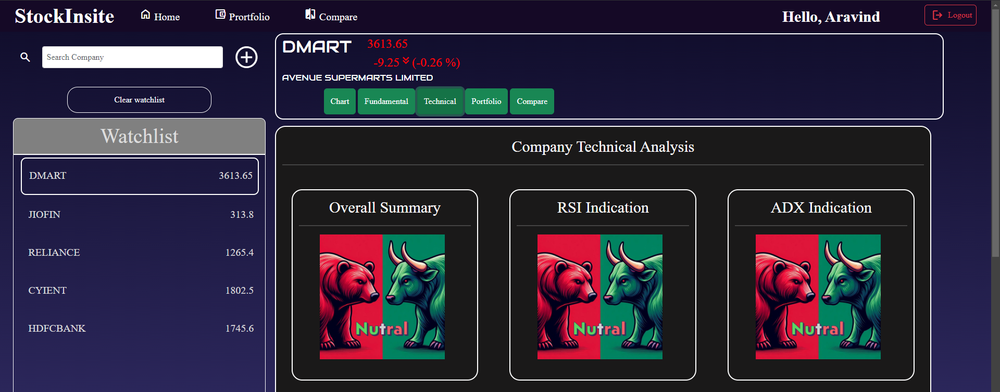

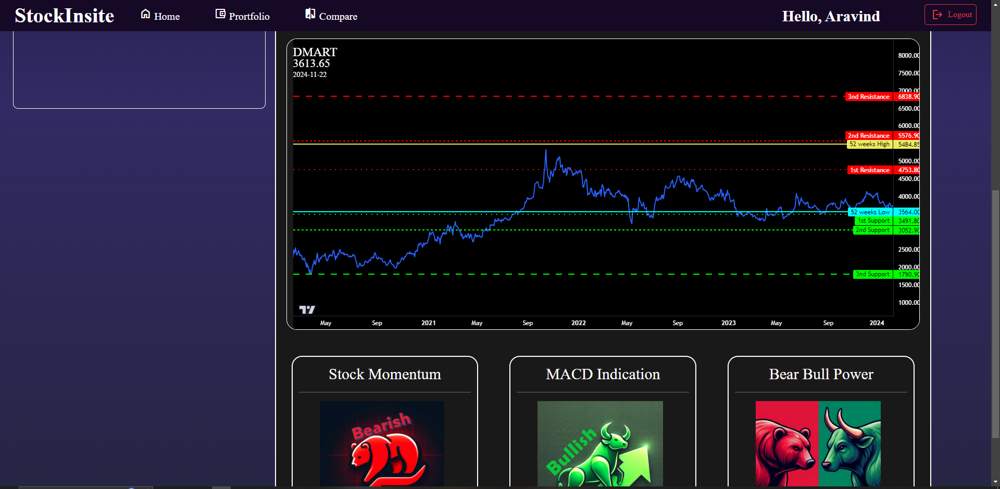

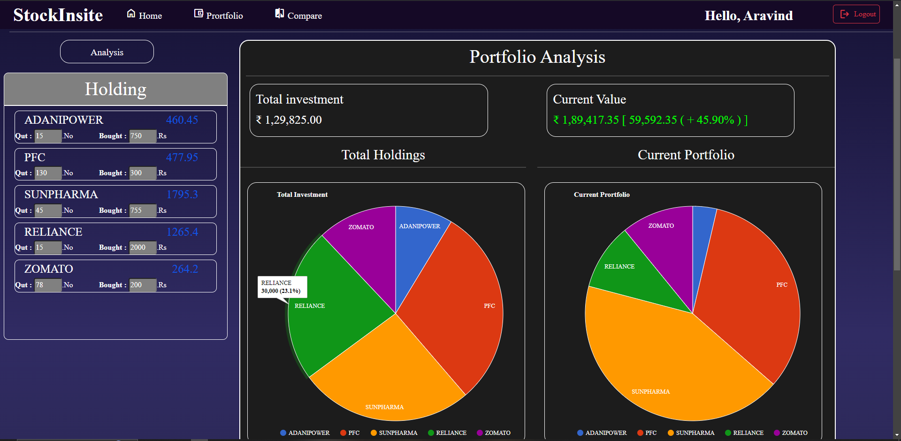

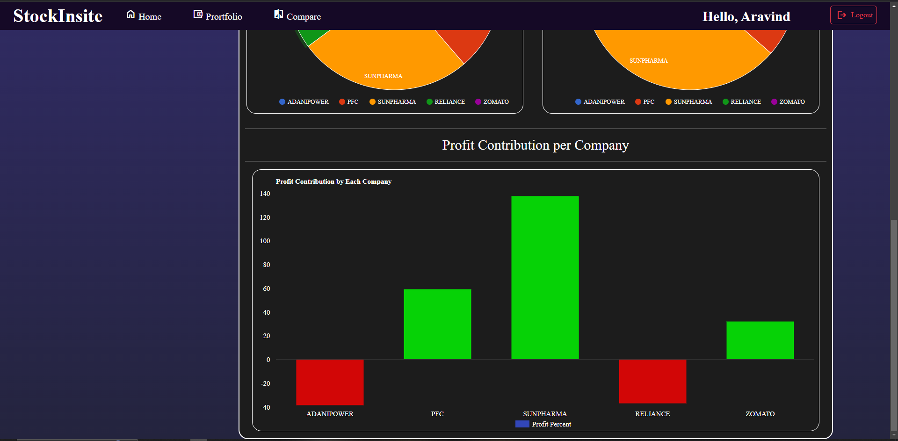

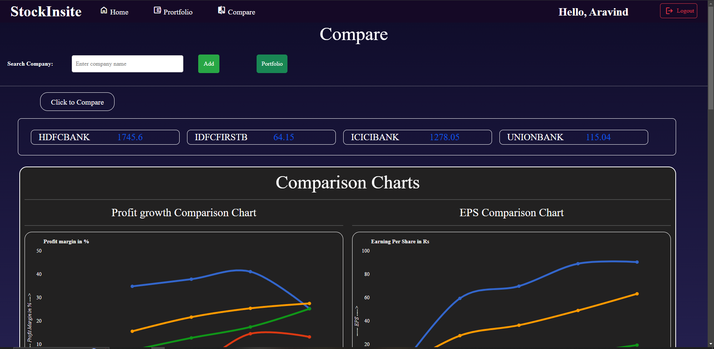

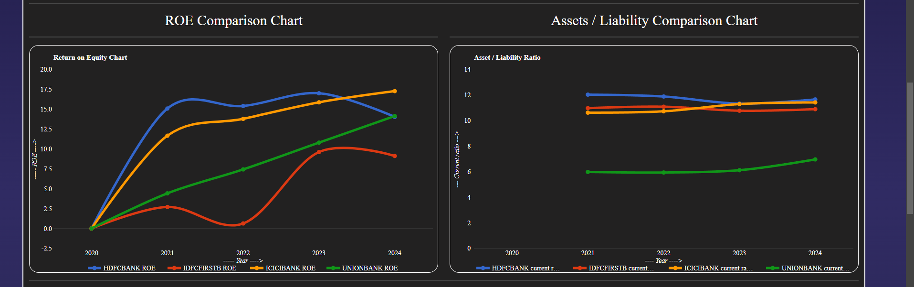

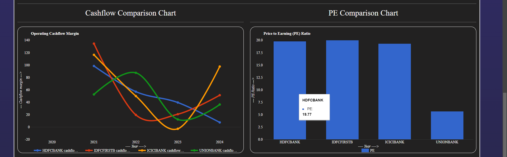

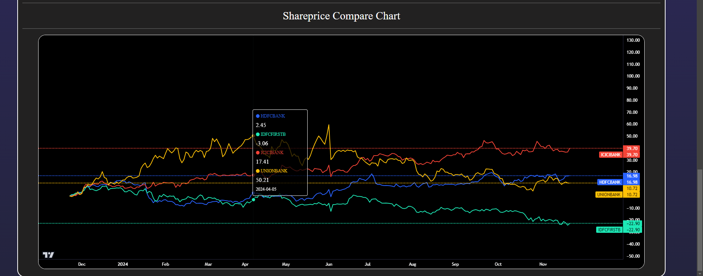
