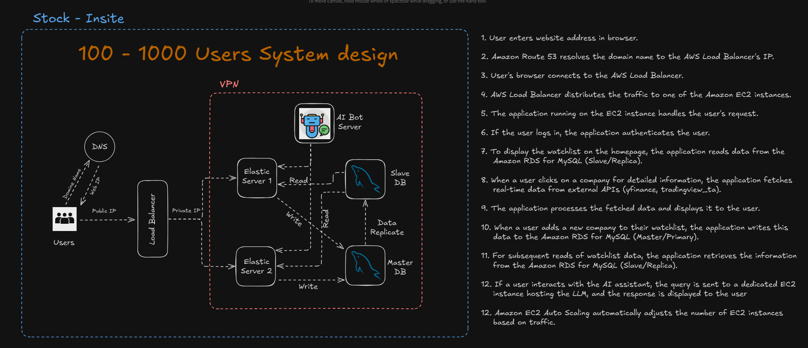

## Stockinsite (A Stock-Broker multi user website)


A comprehensive web application for managing a demat account and performing stock analysis.

* Developed a robust backend using Python Flask and AWS RDS to handle large datasets efficiently, ensuring seamless user experience.
* Implemented advanced data visualization using Google Charts, enabling users to analyze company revenue, profit trends, and balance sheet growth through interactive line and bar graphs.
* Created features for portfolio management, including profit-loss tracking, company-wise contribution analysis, and fund diversification insights.
* Designed comparison tools for evaluating multiple companies’ financial performance, including profit-loss statements, ROE, ROCE, and other fundamental metrics.
* Integrated automated technical level computation for stocks based on fundamental and technical analysis.
* Built a scalable cloud infrastructure and implemented local deployment; currently working on machine learning models to predict stock price trends and adding a stock assistant chatbot.
* **Highlight:** Demonstrated expertise in cloud technologies and programming by architecting a data-intensive solution combining data science and analytics.


## Steps to install project into local

```bash

git clone https://github.com/Aravind8967/stockinsite.git
cd stockinsite

pip install --no-cache-dir -r requirements.txt

# To start the project 

python wsig.py

```

# System design Images




# Project Images


